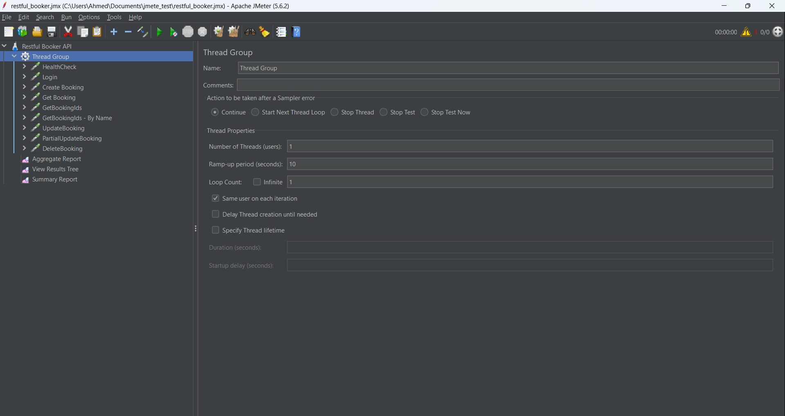
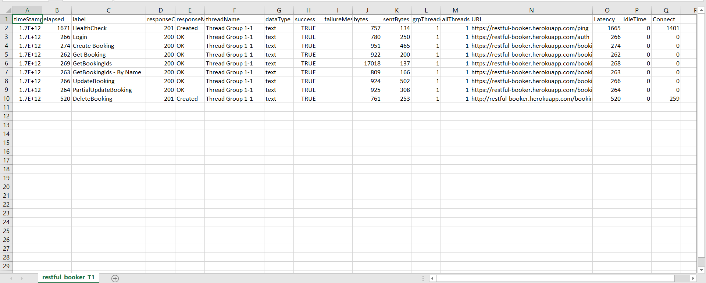
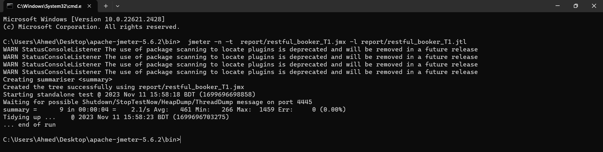
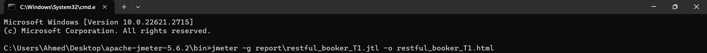
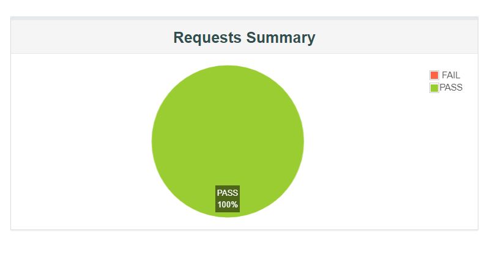
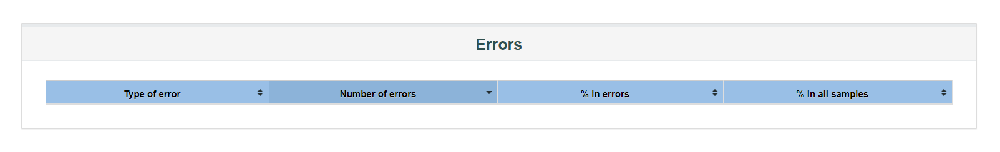
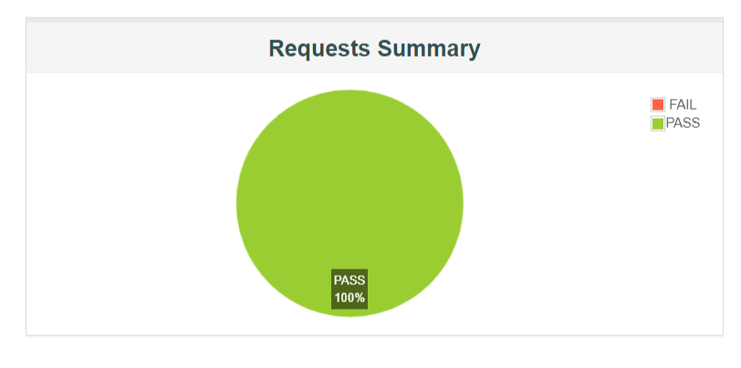
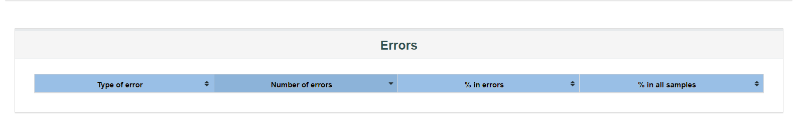
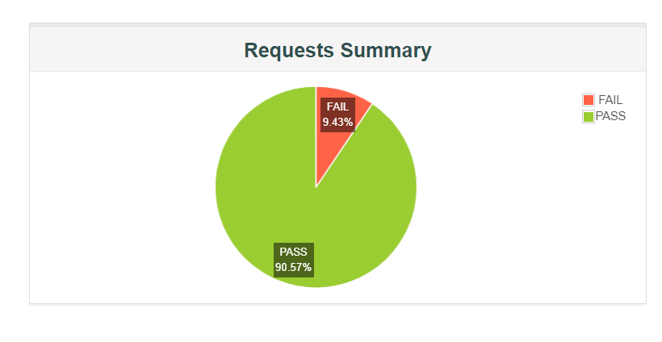
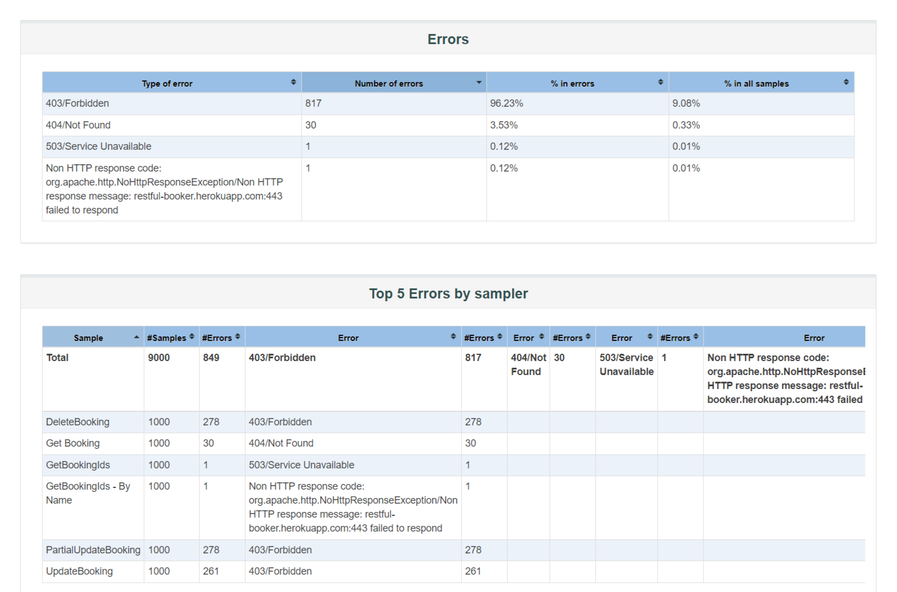

# JMeter_Performance_Test_Report
Here I have done performance testing on Booker API https://restful-booker.herokuapp.com/apidoc/

# Table of Content

- [Load testing Report](#load-testing-report)  
- [Summary](#summary)
- [Introduction](#introduction)
    - [View Report Online](#view-report-online)
- [Install](#install)      
- [Prerequisites](https://github.com/musthafiz/Performance-testing-for-OpenCart-Website#prerequisites)   
- [Elements of a Minimal Test Plan](#prerequisites)    
- [Test Plan](#test-plan)    
- [Collection of API](#collection-of-api)   
    - [List of API](#list-of-api) 
    - [Load the JMeter Script](#load-the-jmeter-script)     
- [Make csv File](#make-csv-file)    
- [Make jtl File](#make-jtl-file)  
- [Make html File](#make-html-file)  
- [HTML Report](#html-report) 
- [Stress Testing](#stress-testing)    
- [Spike Testing](#spike-testing)      
- [Endurance Testing](#endurance-testing)
- [Read Test Data from CSV file in Jmeter](#read-test-data-from-csv-file-in-jmeter)


# Load testing Report

| Concurrent Request  | Loop Count | Avg TPS for Total Samples  | Error Rate | Total Concurrent API request |
|               :---: |      :---: |                      :---: |                        :---: |      :---: |
| 1  | 1  | 3.350  | 0%      | 212   |
| 2  | 1  |  7     | 0%      | 424   |
| 3  | 1  |  11    | 0.47%   | 636   |
| 4  | 1  |  14.1  | 0.59%   | 848   |
| 5  | 1  |  17.6  | 0.94%   | 1060  |
| 6  | 1  |  20    | 1.18%   | 1272  |

# Summary
- While executed 3 concurrent request, found  636 request got connection timeout and error rate is 0.47%.
- Server can handle almost concurrent 424 API call with almost zero (0) error rate.

# Introduction

This document explains how to run a performance test with JMeter against an OpenCart E-commerce Site.

## View Report Online

Report live link: https://reports.ahmedmanan.com/jmeter/

# Install

**Java**  
https://www.oracle.com/java/technologies/downloads/

**JMeter**  
https://jmeter.apache.org/download_jmeter.cgi  

Click =>Binaries    
=>**apache-jmeter-5.6.2.zip**

**We use BlazeMeter to generate JMX files**    
https://chrome.google.com/webstore/detail/blazemeter-the-continuous/mbopgmdnpcbohhpnfglgohlbhfongabi?hl=en

# Prerequisites
- As of JMeter 4.0, Java 8 and above are supported.
- we suggest  multicore cpus with 4 or more cores.
- Memory 16GB RAM is a good value.

# Elements of a minimal test plan
- Thread Group

    The root element of every test plan. Simulates the (concurrent) users and then run all requests. Each thread simulates a single user.

- HTTP Request Default (Configuration Element)

- HTTP Request (Sampler)

- Summary Report (Listener)

# Test Plan

Testplan > Add > Threads (Users) > Thread Group (this might vary dependent on the jMeter version you are using)

- Name: Users
- Number of Threads (users): 1 to 6
- Ramp-Up Period (in seconds): 10
- Loop Count: 1  

  1) The general setting for the tests execution, such as whether Thread Groups will run simultaneously or sequentially, is specified in the item called Test Plan.

  2) All HTTP Requests will use some default settings from the HTTP Request, such as the Server IP, Port Number, and Content-Encoding.

  3) Each Thread Group specifies how the HTTP Requests should be carried out. To determine how many concurrent "users" will be simulated, one must first know the number of threads. The number of actions each "user" will perform is determined by the loop count.

  4) The HTTP Header Manager, which allows you to provide the Request Headers that will be utilized by the upcoming HTTP Requests, is the first item in Thread Groups.

# Collection of API

- Run BlazeMeter  
- Collect Frequently used API  
- Save JMX file then paste => **apache-jmeter-5.6.2\bin**

    ### List of API 

    - https://restful-booker.herokuapp.com/auth
    - https://restful-booker.herokuapp.com/booking
    - https://restful-booker.herokuapp.com/booking/:id
    - https://restful-booker.herokuapp.com/ping

   **OR**
    
  ### Load the JMeter Script 
   - File > Open (CTRL + O)
   - Locate the "restful_booker.jmx" file contained on this repo
   - Continue open restful_booker_T1 to restful_booker_T6
   - Open those file
   - The Test Plan will be loaded  
   
   

                                   
# Test execution (from the Terminal)
 
- JMeter should be initialized in non-GUI mode.
- Make a report folder in the **bin** folder.  
- Run Command in __jmeter\bin__ folder. 

 ### Make csv file    
 
   - **n**: non GUI mode
  - **t**: test plan to execute
  - **l**: output file with results   

```bash
  jmeter -n -t  restful_booker_T1.jmx -l restful_booker_T1.csv
```   



 ### Make jtl file

```bash
  jmeter -n -t  restful_booker_T1.jmx -l restful_booker_T1.jtl
```      
  Then continue to upgrade Threads(1 to 6) by keeping Ramp-up Same.   
  
     

After completing this command  
   ### Make html file   
  
  ```bash
  jmeter -g report\restful_booker_T1.jtl -o restful_booker_T1.html
```
 

  - **g**: jtl results file

  - **o**: path to output folder
  - 
  
  
  

# HTML Report

**Number of Threads 1; Ramp-Up Period 10s**
   
Requests Summary             |  Errors
:-------------------------:|:-------------------------:
  |  

**Number of Threads 100; Ramp-Up Period 10s**
   
Requests Summary             |  Errors
:-------------------------:|:-------------------------:
 |  


**Number of Threads 500; Ramp-Up Period 10s**
   
Requests Summary             |  Errors
:-------------------------:|:-------------------------:
  |  


**Number of Threads 750; Ramp-Up Period 10s**
   
Requests Summary             |  Errors
:-------------------------:|:-------------------------:
  |  


# Stress Testing

Stress Testing is a type of software testing that evaluates how the software responds under extreme conditions. It verifies how robust a system will be, and its response capabilities and error handling when it is subjected to conditions where its normal functioning can be compromised.

**Number of Threads 800 ; Ramp-Up Period 10s**
   
Requests Summary             |  Errors
:-------------------------:|:-------------------------:
 |  

  


**Number of Threads 900 ; Ramp-Up Period 10s**
   
Requests Summary             |  Errors
:-------------------------:|:-------------------------:
 |     


# Spike Testing

Spike testing is a type of performance testing where the demand for an application is suddenly and drastically increased or decreased. Spike testing's objective is to ascertain how a software program will behave under highly variable traffic conditions.

**Number of Threads 1000 ; Ramp-Up Period 10s**
   
Requests Summary             |  Errors
:-------------------------:|:-------------------------:
  |     

# Endurance Testing
An application may be put through endurance testing to see if it can handle the processing load that will be placed on it over an extended period of time. Memory usage is tracked throughout endurance tests to identify potential issues.   

**Start Threads count 6s ; Initial Delay 0s ; Start up Time 10s ; Hold load for 600s ; Shutdown Time 0s**     

Requests Summary             |  Errors
:-------------------------:|:-------------------------:
 | 


